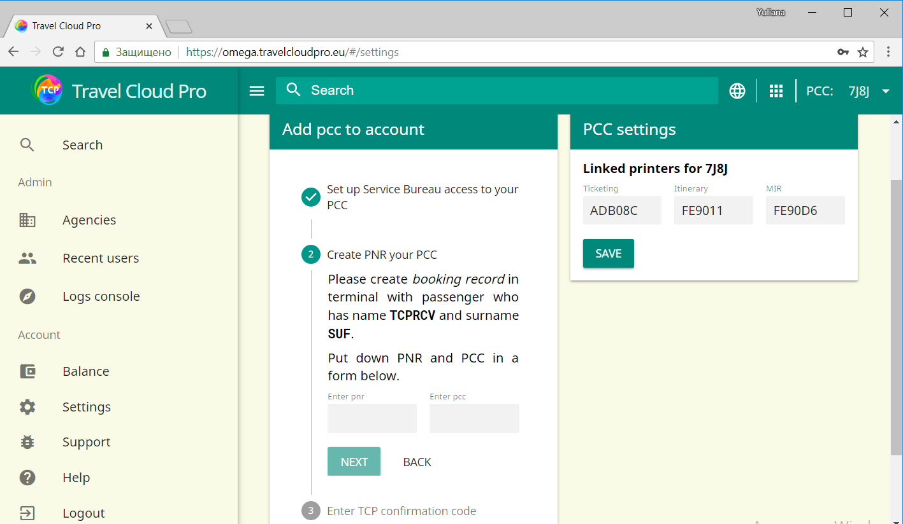

# Добавление PCC в TCP аккаунт

Получить доступ к TCP очень просто:

1. вам потребуется добавить 64UZ в поле SVCB в AAT профиле вашего PCC. Ознакомьтесь с актуальной процедурой, описанной в онлайн справочнике ASK Travelport [AN16072](https://ask.travelport.com/index?page=content&id=AN16072). За более подробной информацией обратитесь к местному представителю Travelport.
2. после добавления 64UZ в поле SVCB вашего PCC, пожалуйста, создайте бронирование, следуя инструкциям, указанным в пункте 2 меню Settings:Обратите внимание на то, что вам нужно будет создать новый PNR в вашем PCC, который вы хотите добавить в TCP. Это просто проверка безопасности, подтверждающая, что вы имеете право создавать и обрабатывать бронирования в этом PCC.
3. Фамилия и имя для резервирования должны быть указаны в PNR точно так же, как написано в меню Settings, без титула пассажира. Фамилия и имя изменяются после каждой перезагрузки страницы.

