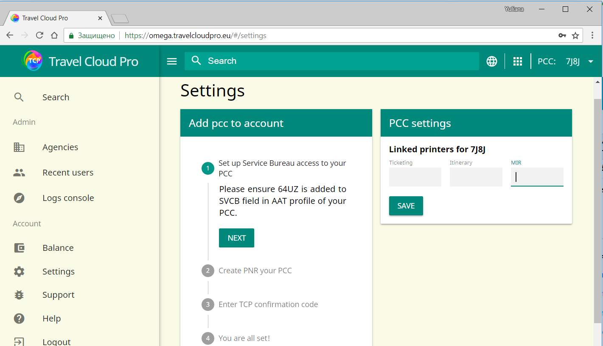
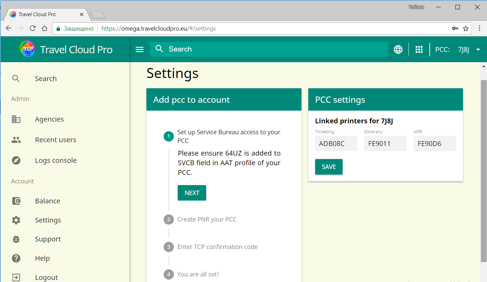

# Настройка принтеров

1. В данном разделе представлены настройки GTID для линковки принтеров TKT, ITN для оформления маршрутной документации, а также можно по желанию подлинковать GTID для системы MIR.

1. Введите GTID для TKT принтера \(Ticketing\), ITN принтера \(Itinerary\) и принтер MIR \(если используется\) и нажмите кнопку SAVE.
2. Чтобы проверить, какие именно GTID в настоящее время подлинкованы для вашего РСС в Smartpoint, вы можете использовать формат команды HMLD, дополнительную информацию можно найти в онлайн справочнике [ASK Travelport Answer ID AN 229](https://ask.travelport.com/index?page=content&id=AN229&actp=search&viewlocale=en_US&searchid=1525947411927).
3. После того, как GTID были успешно добавлены и сохранены, TCP отображает сообщение с подтверждением того, что настройки сохранены, а соединения с принтером теперь отображаются в TCP

​

