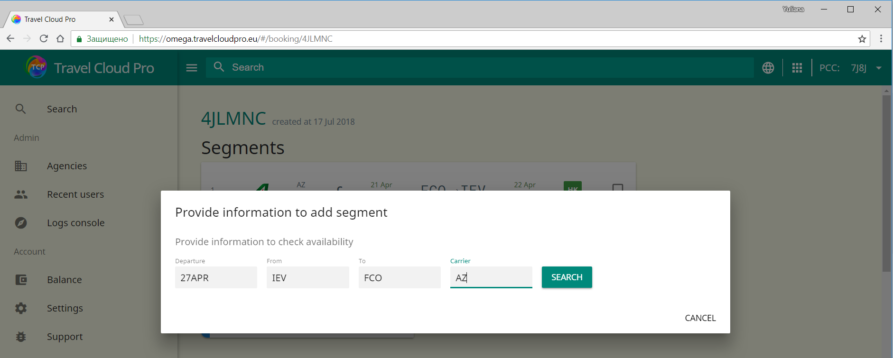
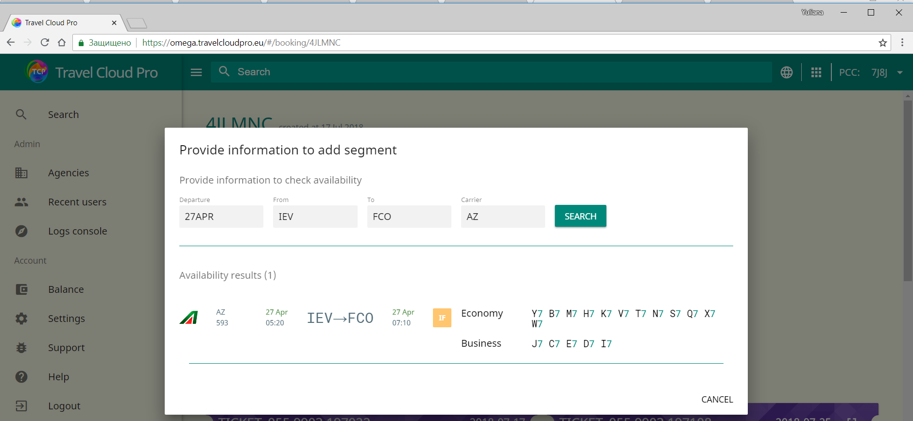
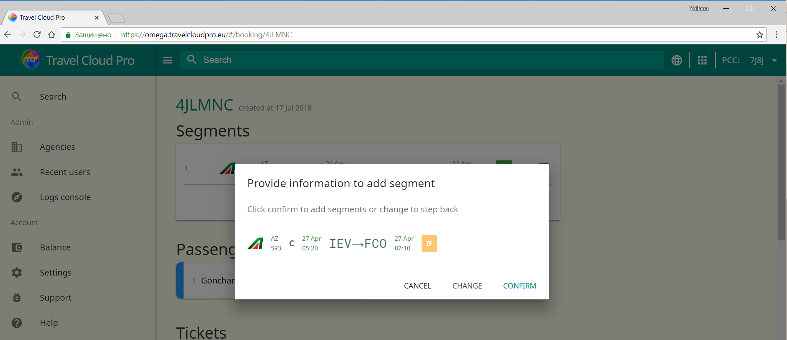
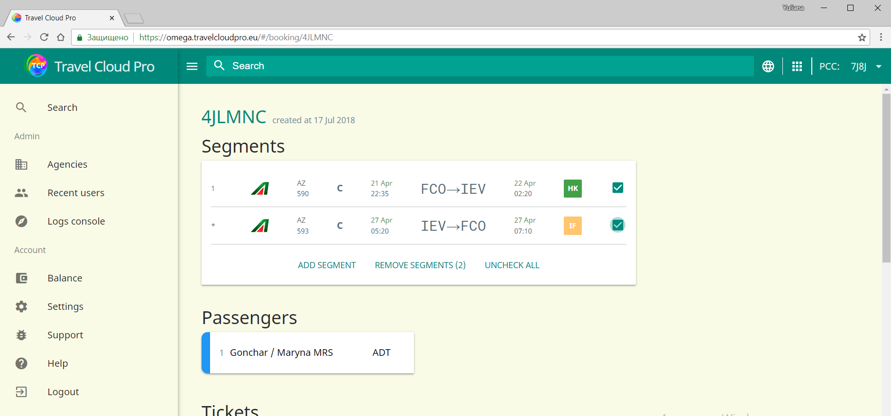
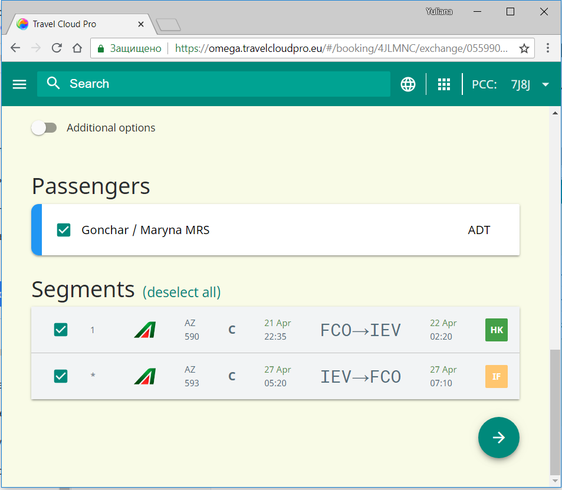

# Добавление информационных сегментов в TCP

TCP позволяет временно бронировать сегменты в существующем бронировании, добавляя новые сегменты напрямую через интерфейс TCP. Никаких дополнительных приложений, никаких криптических форматов команд в терминале GDS.

1. Внесите базовые критерии для запроса наличия мест \(дата, код города/аэропорта вылета и код города/аэропорта назначения, код авиакомпании\) и нажмите кнопку "Поиск".
2. Выберите необходимый рейс и класс бронирования:
3. Подтвердите свой выбор, нажав на кнопку "Подтвердить"
4. Только что добавленный  сегмент используется для создания "информационного" расчета тарифа в TCP, но такой расчет тарифа не сохраняется в PNR. 
5. Для создания информационного расчета нужно отмтить галочками чекбоксы напротив тех сегментов, по которым нужно осуществить обмен:
6. Нажать кнопку "Обмен" в билете:

   

