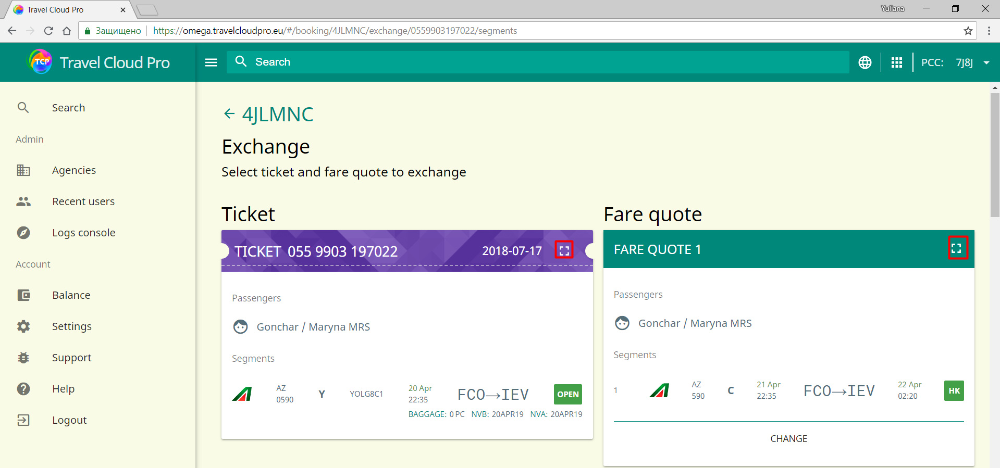
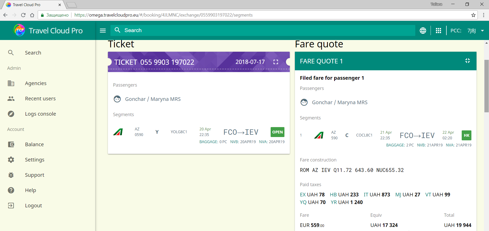
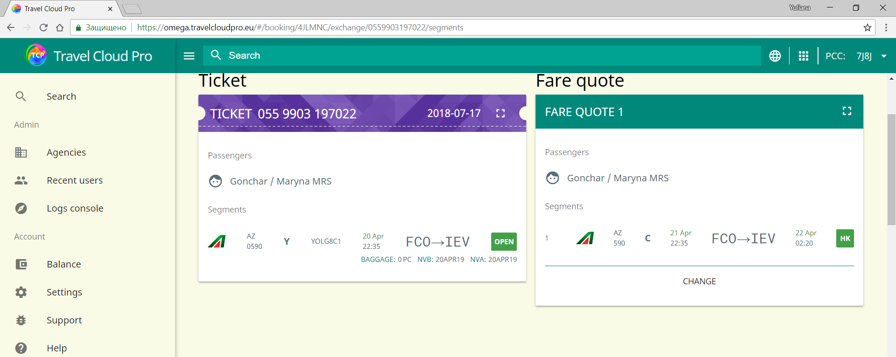
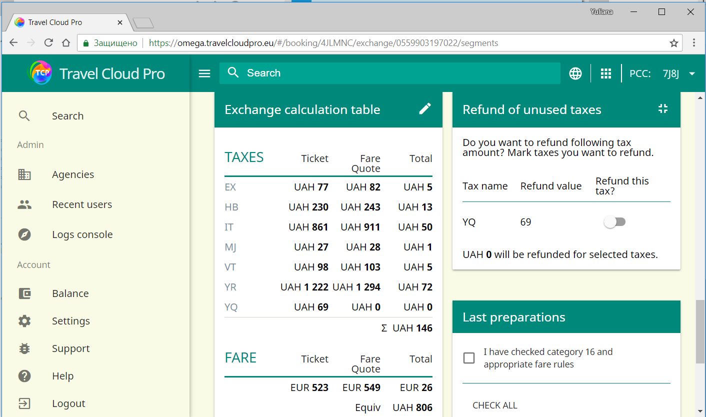

# Как активировать детальный просмотр?

По умолчанию TCP показывает поля PNR \(расчет тарифа, данные электронных билетов и т. д.\) в свернутом виде.

Чтобы развернуть эти поля, необходимо щелкнуть по кнопке «увеличительное стекло» в верхнем правом углу соответствующего поля.Чтобы свернуть подробный вид, просто нажмите на кнопку еще раз:

Некоторые поля отображаются в развернутом виде по умолчанию, например, поле «Возврат неиспользуемых такс»:

