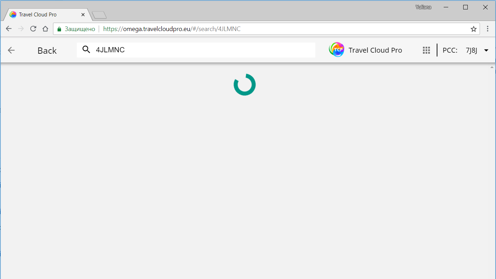
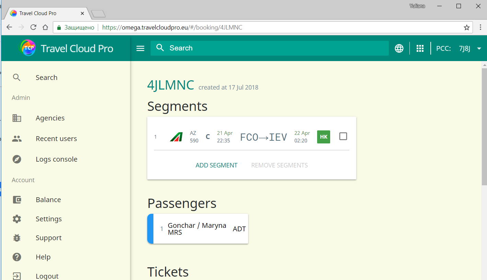
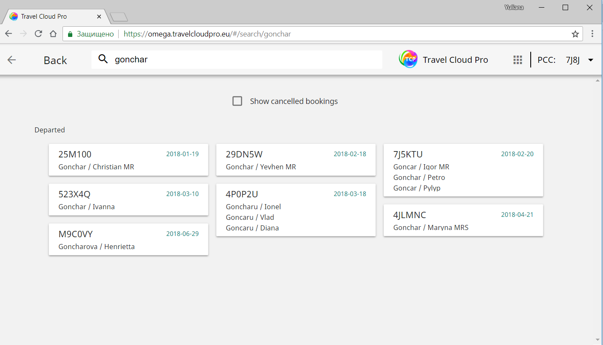

# Как открыть бронирование в ТСР?

Чтобы открыть PNR в TCP, просто введите локатор бронирования Galileo или фамилию пассажира в поле поиска.

## Поиск по локатору бронирования

Просто введите 6-значный локатор Galileo в поле Search и нажмите Enter.

## Поиск по фамилии пассажира

Если вы не помните локатор PNR, используйте поиск по фамилии пассажира.

1. Внесите нужную фамилию в поле поиска.
2. Нажмите на карту PNR, чтобы отобразить дополнительную информацию и продолжить обмен билетами.

