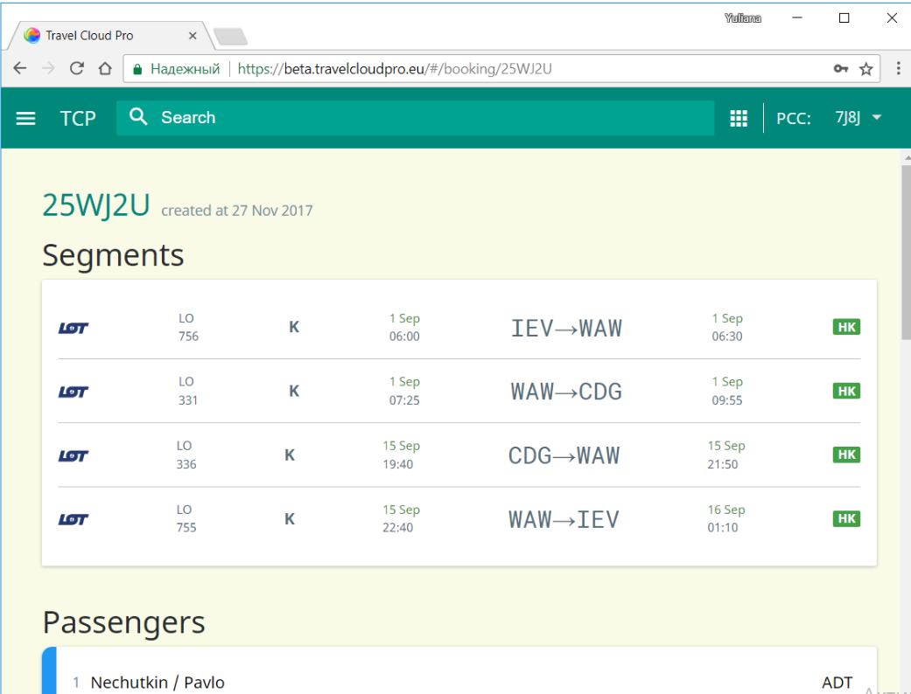
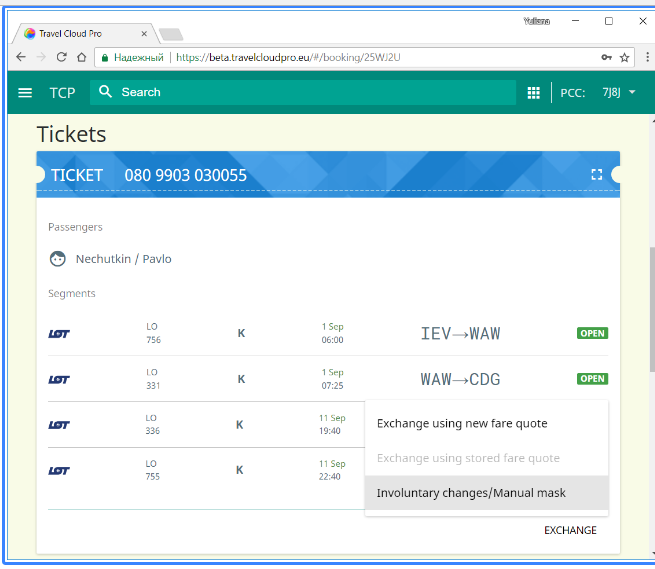
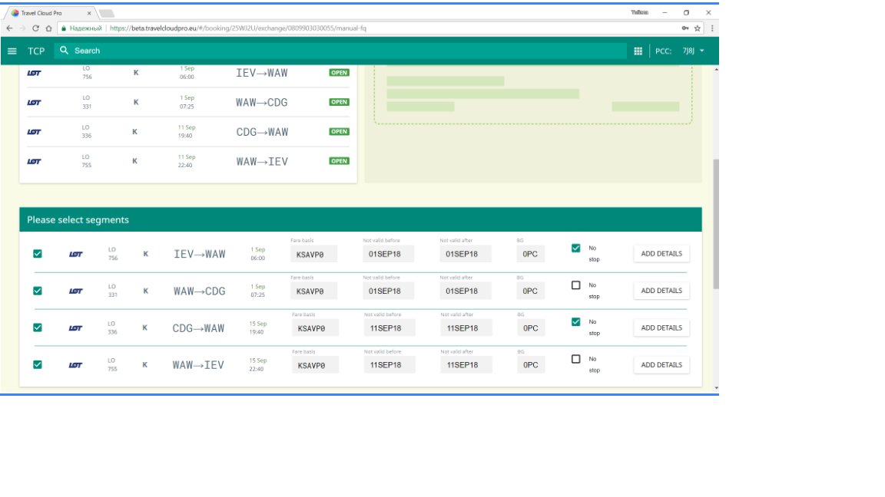
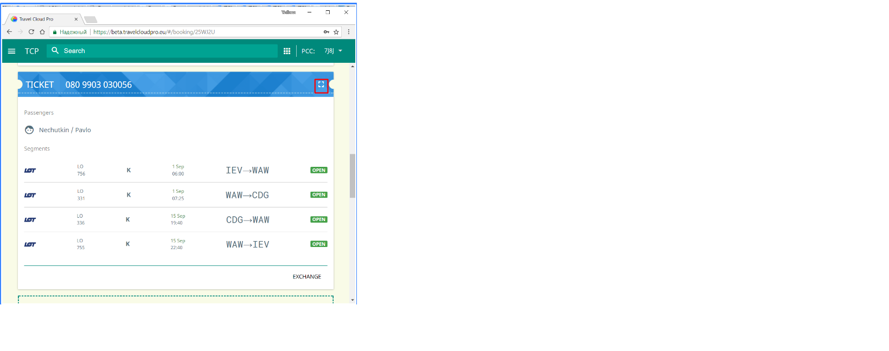

# Обмен по мануальной маске

## Рерутинг с использованием форматов ручного построения тарифной маски

Пассажир изначально купил билет на перелет из Киева в Париж со стыковкой в Варшаве на 01 сентября и обратно обратно на 11 сентября. Затем из-за забастовки по 11 сентября дата поездки должна быть изменена на 15 SEP. Соответственно были изменены сегменты полета. 

Чтобы произвести рерутинг в связи с этими изменениями, необходимо предпринять следующие шаги:

1. Открыть бронирование в TCP, выполнив поиск по локатору Galileo или по имени пассажира:
2. В поле с информацией о билете нажать на ссылку "Обмен" и выбрать опцию «Вынужденный обмен/Мануальный расчет тарифа»
3. Выберите сегменты для обмена и установите флажки «Нет остановок», чтобы указать, что нет трансфера. Оставшиеся поля для маски ручного построения тарифа будут заполнены автоматически:
4. Удалите все таксы, проверьте данные расчета и нажмите кнопку «Применить»
5. Укажите, нужно ли взимать штраф за изменение билета, по умолчанию выбран вариант «Без штрафа».
6. Если для нового билета применяется другая комиссия, TCP позволяет указать ее размер вручную, выбрав сумму или процент .
7. Вставьте текст передаточной надписи \(Endorsement\) в поле "Дополнительные параметры".
8. Проверьте таблицу калькуляции обмена.
9. Активировать тогл боксы для такс, которые необходимо вернуть.
10. Выбрать, должен ли новый билет быть оформлен сейчас или позже. Приведенный в качестве примера сценарий использует опцию «Оформить билет». Не забудьте нажать зеленую стрелку, чтобы завершить процедуру обмена.
11. Проверьте подробный билет для недавно обмененного билета, нажав кнопку «Развернуть».

