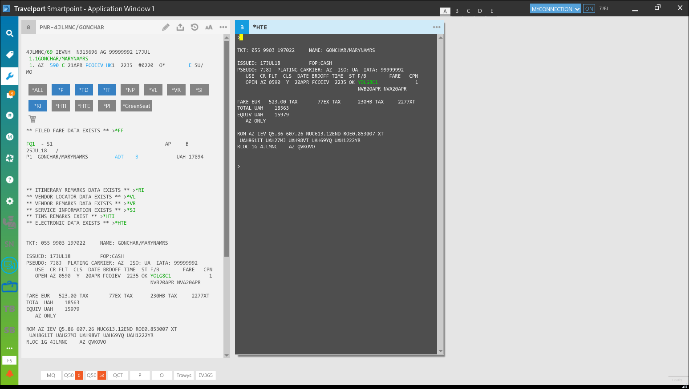
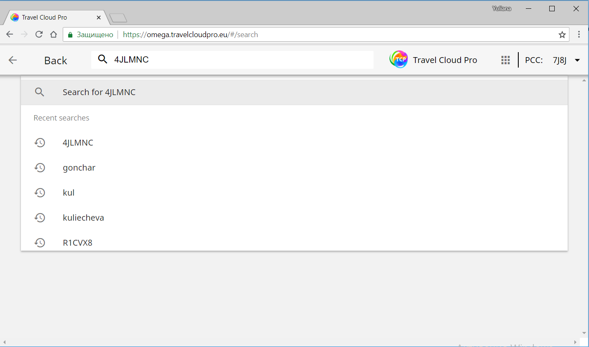
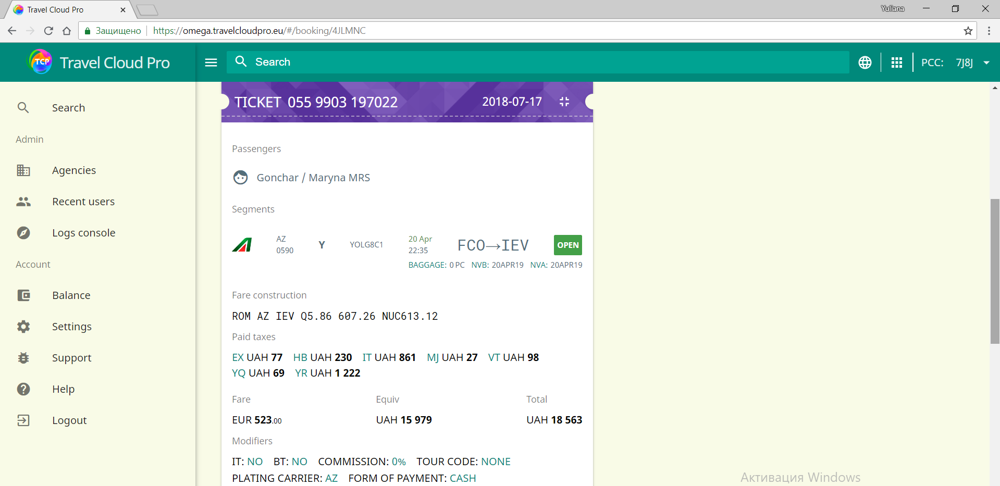
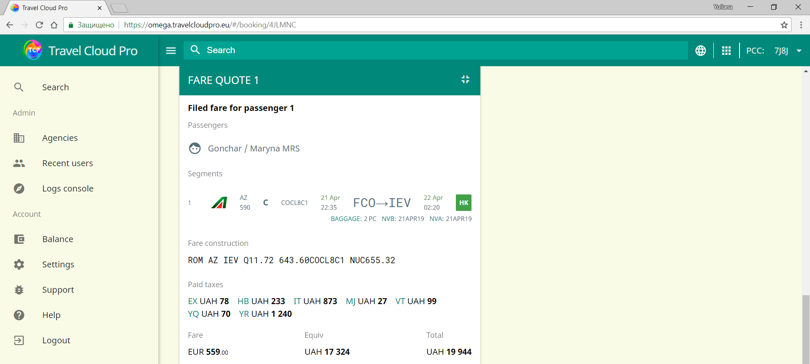
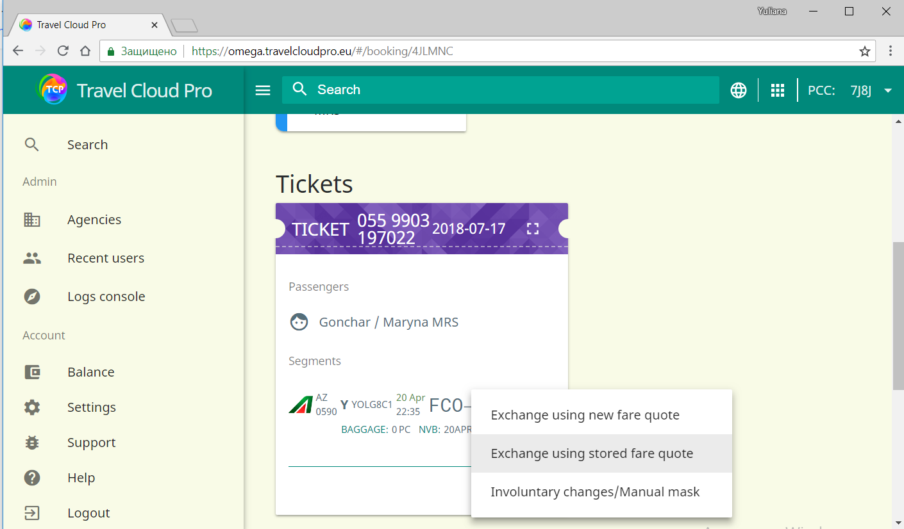
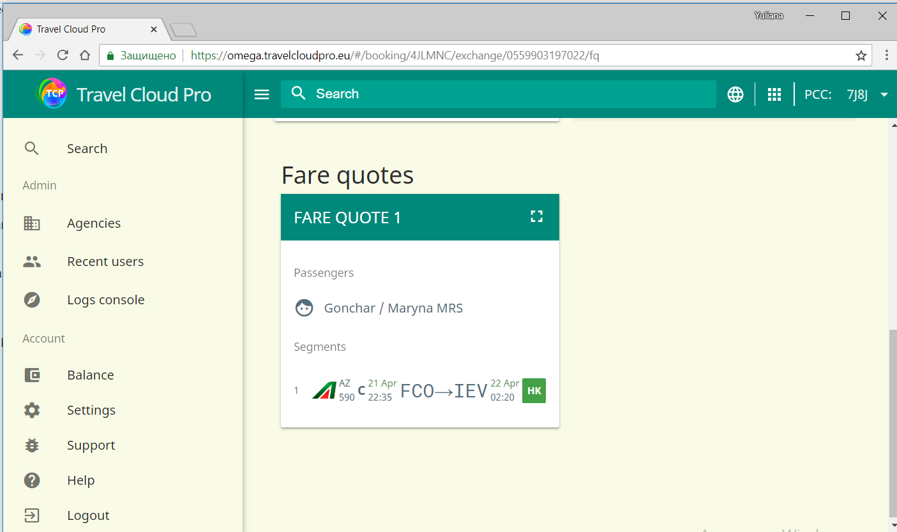
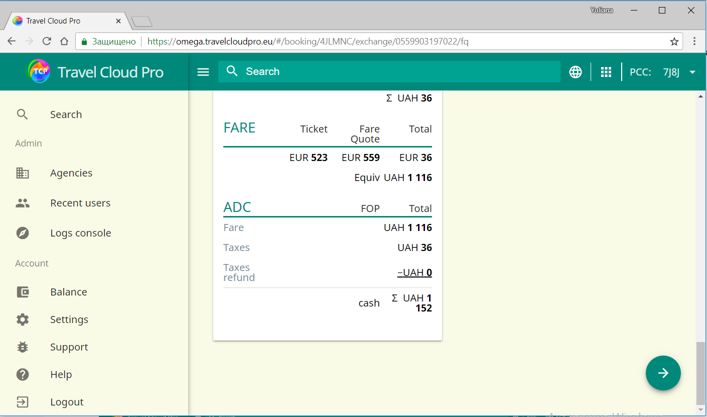
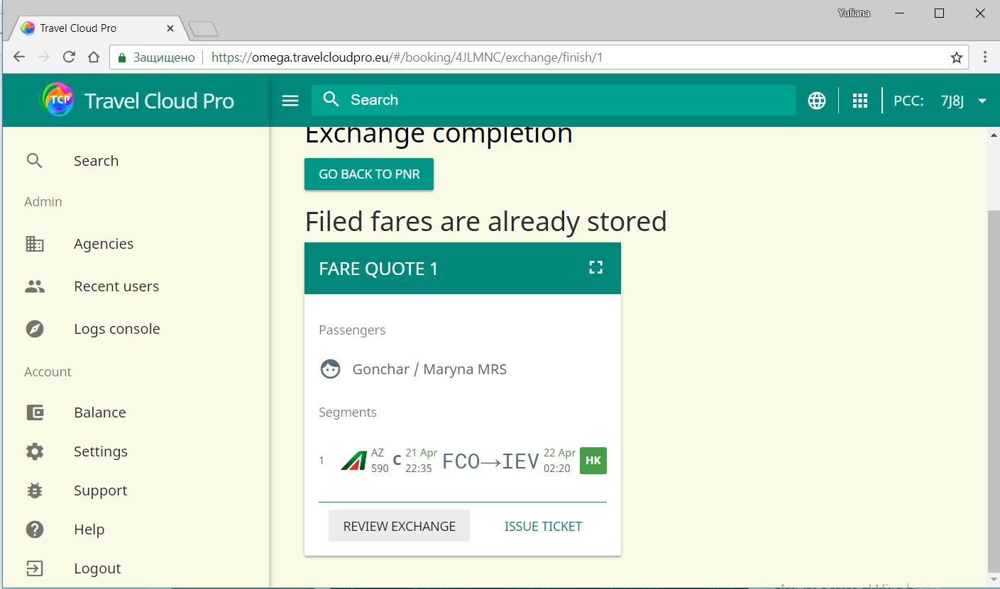
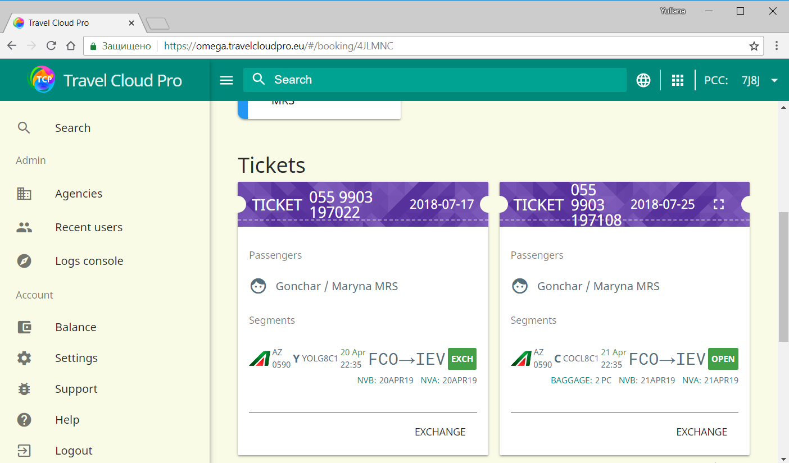
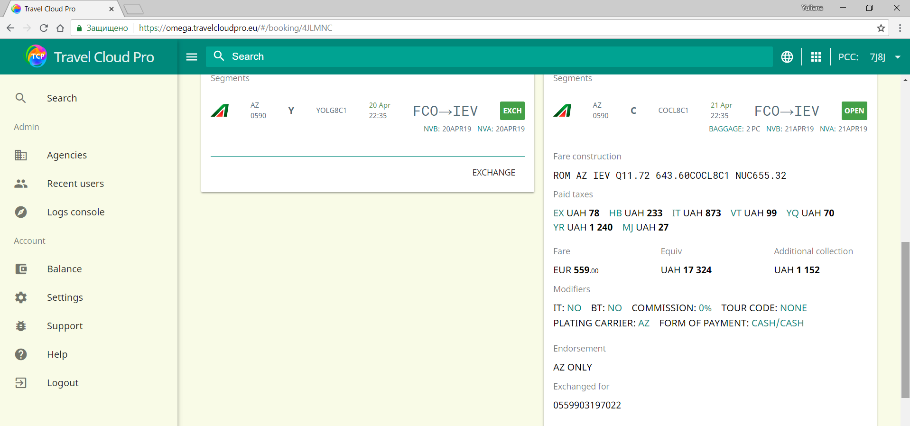

# Обмен по сохраненному тарифу

Ниже приводится описание обмена билета, при котором производится обмен с добором, используя уже сохраненный в бронировании расчет тарифа.

Первоначально клиент забронировал перелет из Рима в Киев 20 апреля:

1. Билет был оформлен по тарифу EUR 523.00 плюс таксы: 77EX, 230HB, 2277XT
2. Затем клиент решает изменить дату  на 21 апреля.
3. Новый тариф маршрута протарифицирован с использованием команды FQ, изменения успешно сохранены в Travelport Smartpoint.
4. Откройте это бронирование в TCP, введя локатор Galileo или фамилию пассажира в меню поиска
5. TCP отображает обновленный маршрут, информацию об изначально оформленном билете и новый расчет тарифа, который уже был сохранен в этом PNR
6. Нажмите на ссылку «Обмен» и выберите опцию «Обмен по сохраненному тарифу» 
7. Выберите тариф, по которому должен быть оформлен новый билет
8. Проверьте таблицу расчета обмена, автоматически заполненную TCP. Отметьте галочкой чекбоксы в поле "Последние приготовления" и нажмите на зеленую стрелочку
9. Для проверки правильности информации, по которой будет произведен обмен билета достаточно нажать на ссылку "Предпросмотр обмена". На данном этапе можно вернуться к бронированию, не оформляя новый билет. Для этого используется кнопка "Возврат к бронированию" 
10. При выборе опции "Оформить билет" производится выписка нового билета
11. TCP отображает уведомление об успешной выписке нового билета. Чтобы увидеть детальную информацию по новому билету, достаточно нажать на локатор бронирования и обновить страницу

